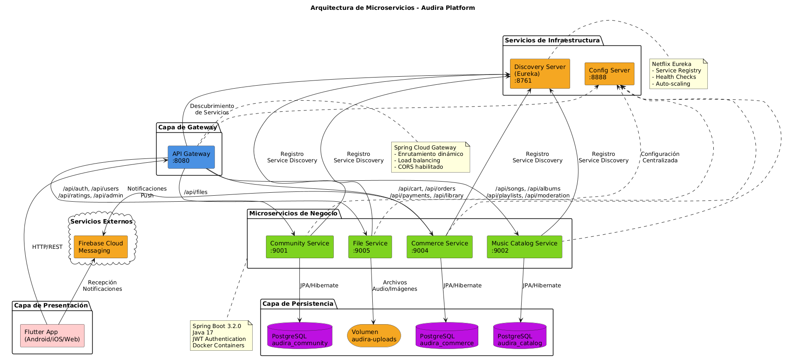
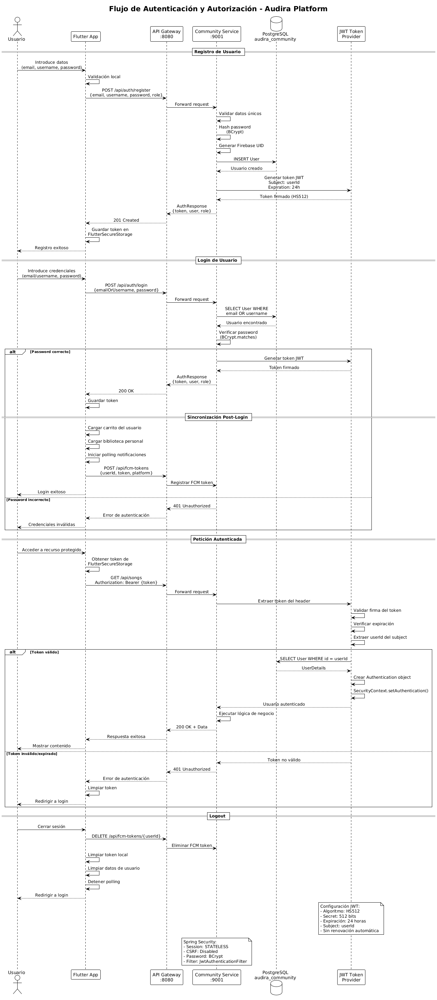
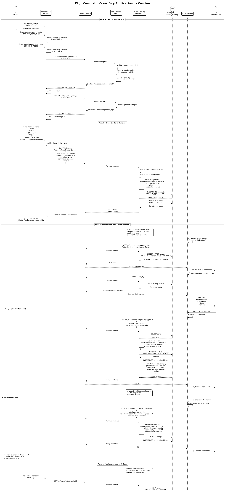
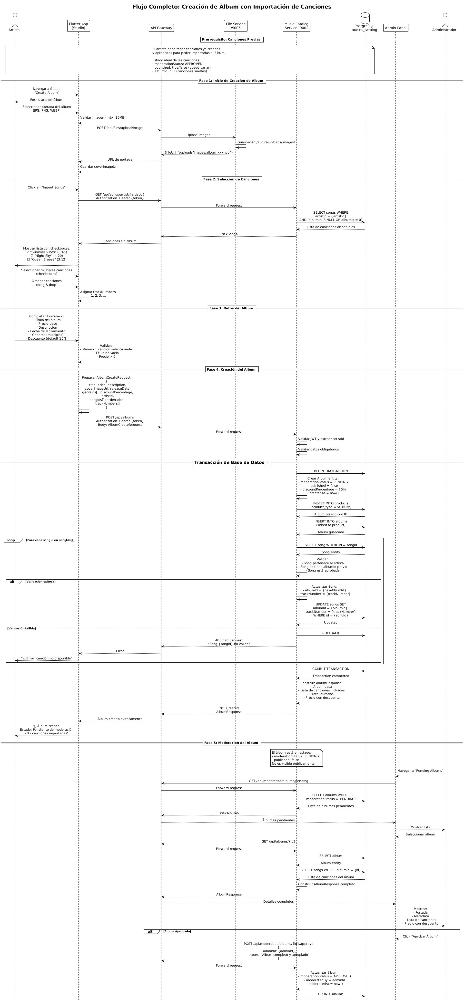
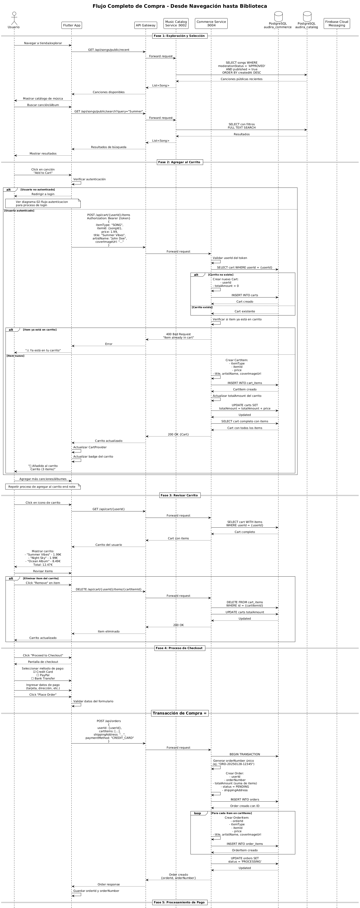
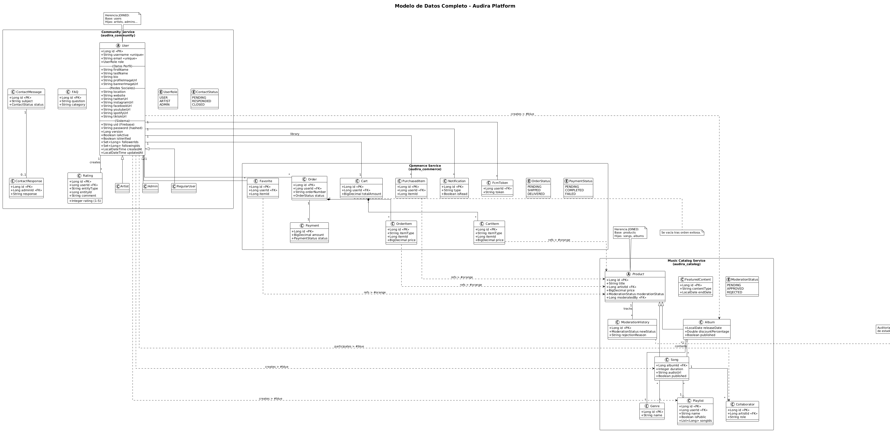

# 🎵 AUDIRA - Plataforma Musical Descentralizada

 

> Una plataforma estilo Bandcamp construida con arquitectura de microservicios

 

[](https://www.oracle.com/java/)

[](https://spring.io/projects/spring-boot)

[](https://flutter.dev/)

[](https://www.postgresql.org/)

[](https://www.docker.com/)

 

---

 

## 📋 Tabla de Contenidos

 

1. [Descripción General](#-descripción-general)

2. [Arquitectura del Sistema](#-arquitectura-del-sistema)

3. [Tecnologías Utilizadas](#-tecnologías-utilizadas)

4. [Estructura del Proyecto](#-estructura-del-proyecto)

5. [Microservicios](#-microservicios)

6. [Flujos Principales](#-flujos-principales)

7. [Modelo de Datos](#-modelo-de-datos)

8. [Configuración y Despliegue](#-configuración-y-despliegue)

9. [API Documentation](#-api-documentation)

10. [Seguridad](#-seguridad)

11. [Desarrollo](#-desarrollo)

 

---

 

## 🎯 Descripción General

 

**Audira** es una plataforma musical completa que permite a artistas subir, vender y gestionar su música, mientras que los usuarios pueden descubrir, comprar y disfrutar de contenido musical. Similar a Bandcamp, conecta directamente a artistas con fans eliminando intermediarios.

 

### Características Principales

 

- ✅ **Gestión de Usuarios**: Artistas, usuarios regulares y administradores con roles diferenciados

- 🎼 **Catálogo Musical**: Canciones, álbumes, playlists y géneros musicales

- 🛒 **Sistema de Comercio**: Carrito de compras, órdenes, pagos y biblioteca personal

- 📁 **Gestión de Archivos**: Subida de audio (MP3, WAV, FLAC) e imágenes

- 👮 **Sistema de Moderación**: Aprobación/rechazo de contenido por administradores

- 🔐 **Autenticación JWT**: Seguridad stateless con tokens de 24 horas

- 🔔 **Notificaciones Push**: Firebase Cloud Messaging integrado

- 📊 **Estadísticas**: Métricas de reproducción, ventas y popularidad

- 📱 **Multiplataforma**: Aplicación Flutter para Android, iOS y Web

 

### Roles de Usuario

 

|        Rol       |       Descripción      |                         Capacidades                         |

|------------------|------------------------|-------------------------------------------------------------|

|     **Guest**    | Usuario no autenticado |          Navegar catálogo público, buscar música            |

| **Regular User** |   Usuario registrado   |      Comprar, crear playlists, valorar, seguir artistas     |

|    **Artist**    |  Creador de contenido  | Todo lo de User + subir canciones/álbumes, ver estadísticas |

|     **Admin**    |      Administrador     |   Todo lo anterior + moderar contenido, gestionar usuarios  |

 

---

 

## 🏗️ Arquitectura del Sistema

 

Audira sigue un patrón de **arquitectura de microservicios** con Spring Cloud, permitiendo escalabilidad, mantenimiento independiente y alta disponibilidad.

 



 

### Componentes Principales

 

```

┌─────────────────────────────────────────────────────────────┐

│                     FLUTTER APP                              │

│              (Android / iOS / Web)                           │

└──────────────────────┬──────────────────────────────────────┘

                       │ HTTP/REST

                       ▼

┌─────────────────────────────────────────────────────────────┐

│                  API GATEWAY :8080                           │

│           (Spring Cloud Gateway - Reactive)                  │

└──────────────────────┬──────────────────────────────────────┘

                       │

        ┌──────────────┼──────────────┬──────────────┐

        ▼              ▼              ▼              ▼

┌──────────────┐ ┌──────────┐ ┌──────────┐ ┌──────────────┐

│  Community   │ │  Music   │ │ Commerce │ │     File     │

│  Service     │ │ Catalog  │ │ Service  │ │   Service    │

│    :9001     │ │  :9002   │ │  :9004   │ │    :9005     │

└──────┬───────┘ └────┬─────┘ └────┬─────┘ └──────┬───────┘

       │              │             │               │

       ▼              ▼             ▼               ▼

┌──────────────┐ ┌──────────┐ ┌──────────┐ ┌─────────────┐

│ PostgreSQL   │ │PostgreSQL│ │PostgreSQL│ │   Volume    │

│ community    │ │ catalog  │ │ commerce │ │   uploads   │

└──────────────┘ └──────────┘ └──────────┘ └─────────────┘

 

        ┌──────────────────────────────────────┐

        │    INFRASTRUCTURE SERVICES           │

        ├──────────────────┬───────────────────┤

        │ Config Server    │ Discovery Server  │

        │    :8888         │  (Eureka) :8761   │

        └──────────────────┴───────────────────┘

```

 

### Patrones Arquitectónicos Implementados

 

- **API Gateway Pattern**: Punto de entrada único para todas las peticiones

- **Service Discovery**: Netflix Eureka para registro dinámico de servicios

- **Centralized Configuration**: Spring Cloud Config para gestión de configuración

- **Database per Service**: Cada microservicio tiene su propia base de datos

- **Stateless Authentication**: JWT para autenticación sin sesiones

- **Event-Driven (parcial)**: Notificaciones push con Firebase

 

---

 

## 🛠️ Tecnologías Utilizadas

 

### Backend

 

| Tecnología | Versión | Propósito |

|------------|---------|-----------|

| **Java** | 17 | Lenguaje principal |

| **Spring Boot** | 3.2.0 | Framework de aplicación |

| **Spring Cloud** | 2023.0.0 | Microservicios (Gateway, Config, Eureka) |

| **Spring Security** | 6.x | Autenticación y autorización |

| **Spring Data JPA** | 3.2.0 | Persistencia y ORM |

| **PostgreSQL** | 15-alpine | Base de datos relacional |

| **JWT (jjwt)** | 0.11.5 | Tokens de autenticación |

| **Lombok** | - | Reducción de boilerplate |

| **Maven** | 3.8+ | Gestión de dependencias |

| **Docker** | - | Contenedores |

| **Docker Compose** | 3.8 | Orquestación de contenedores |

 

### Frontend

 

| Tecnología | Versión | Propósito |

|------------|---------|-----------|

| **Flutter** | 3.0+ | Framework multiplataforma |

| **Dart** | 3.0+ | Lenguaje de programación |

| **Provider** | 6.1.1 | State management |

| **Riverpod** | 3.0.3 | State management avanzado |

| **GoRouter** | 16.3.0 | Navegación declarativa |

| **Dio** | 5.4.0 | Cliente HTTP |

| **JustAudio** | 0.10.5 | Reproductor de audio |

| **Firebase Messaging** | 15.1.5 | Notificaciones push |

| **Flutter Secure Storage** | - | Almacenamiento seguro de tokens |

| **Hive** | - | Base de datos local |

| **Cached Network Image** | - | Caché de imágenes |

 

### Infraestructura

 

- **Spring Boot Actuator**: Health checks y monitoreo

- **Netflix Eureka**: Service Discovery

- **Spring Cloud Gateway**: API Gateway reactivo

- **Spring Cloud Config**: Configuración centralizada

- **Firebase Cloud Messaging**: Notificaciones push

- **Docker Volumes**: Persistencia de datos

 

---

 

## 📂 Estructura del Proyecto

 

```

practical-wing/

├── api-gateway/                    # API Gateway (Puerto 8080)

│   ├── src/main/java/io/audira/gateway/

│   │   ├── config/

│   │   │   └── SecurityConfig.java

│   │   └── ApiGatewayApplication.java

│   └── src/main/resources/

│       └── application.yml

│

├── config-server/                  # Config Server (Puerto 8888)

│   ├── src/main/java/io/audira/config/

│   │   └── ConfigServerApplication.java

│   └── src/main/resources/

│       └── application.yml

│

├── discovery-server/               # Eureka Server (Puerto 8761)

│   ├── src/main/java/io/audira/discovery/

│   │   └── DiscoveryServerApplication.java

│   └── src/main/resources/

│       └── application.yml

│

├── community-service/              # ÉPICA 1: Community (Puerto 9001)

│   ├── src/main/java/io/audira/community/

│   │   ├── controller/            # REST Controllers

│   │   │   ├── AuthController.java

│   │   │   ├── UserController.java

│   │   │   ├── AdminController.java

│   │   │   ├── RatingController.java

│   │   │   ├── ContactController.java

│   │   │   └── FAQController.java

│   │   ├── model/                 # Entidades JPA

│   │   │   ├── User.java (abstracta)

│   │   │   ├── Artist.java

│   │   │   ├── Admin.java

│   │   │   ├── RegularUser.java

│   │   │   ├── Rating.java

│   │   │   ├── ContactMessage.java

│   │   │   └── FAQ.java

│   │   ├── repository/            # Repositorios Spring Data

│   │   ├── service/               # Lógica de negocio

│   │   ├── security/              # JWT, Filters, Config

│   │   │   ├── JwtTokenProvider.java

│   │   │   ├── JwtAuthenticationFilter.java

│   │   │   └── SecurityConfig.java

│   │   └── dto/                   # Data Transfer Objects

│   └── src/main/resources/

│       └── application.yml

│

├── music-catalog-service/          # ÉPICA 2: Music Catalog (Puerto 9002)

│   ├── src/main/java/io/audira/catalog/

│   │   ├── controller/

│   │   │   ├── SongController.java

│   │   │   ├── AlbumController.java

│   │   │   ├── PlaylistController.java

│   │   │   ├── GenreController.java

│   │   │   ├── ModerationController.java

│   │   │   ├── CollaboratorController.java

│   │   │   ├── DiscoveryController.java

│   │   │   ├── FeaturedContentController.java

│   │   │   └── MetricsController.java

│   │   ├── model/

│   │   │   ├── Product.java (abstracta)

│   │   │   ├── Song.java

│   │   │   ├── Album.java

│   │   │   ├── Genre.java

│   │   │   ├── Playlist.java

│   │   │   ├── Collaborator.java

│   │   │   ├── FeaturedContent.java

│   │   │   └── ModerationHistory.java

│   │   ├── repository/

│   │   ├── service/

│   │   └── dto/

│   └── src/main/resources/

│       └── application.yml

│

├── commerce-service/               # ÉPICA 4: Commerce (Puerto 9004)

│   ├── src/main/java/io/audira/commerce/

│   │   ├── controller/

│   │   │   ├── CartController.java

│   │   │   ├── OrderController.java

│   │   │   ├── PaymentController.java

│   │   │   ├── LibraryController.java

│   │   │   ├── FavoriteController.java

│   │   │   ├── NotificationController.java

│   │   │   ├── ReceiptController.java

│   │   │   └── FcmTokenController.java

│   │   ├── model/

│   │   │   ├── Cart.java

│   │   │   ├── CartItem.java

│   │   │   ├── Order.java

│   │   │   ├── OrderItem.java

│   │   │   ├── Payment.java

│   │   │   ├── PurchasedItem.java

│   │   │   ├── Favorite.java

│   │   │   ├── Notification.java

│   │   │   └── FcmToken.java

│   │   ├── repository/

│   │   ├── service/

│   │   └── dto/

│   └── src/main/resources/

│       └── application.yml

│

├── file-service/                   # File Management (Puerto 9005)

│   ├── src/main/java/io/audira/fileservice/

│   │   ├── controller/

│   │   │   ├── FileUploadController.java

│   │   │   ├── FileServeController.java

│   │   │   └── FileCompressionController.java

│   │   ├── service/

│   │   └── config/

│   └── src/main/resources/

│       └── application.yml

│

├── audira_flutter/                 # Flutter Application

│   ├── lib/

│   │   ├── config/                # Configuración

│   │   │   ├── constants.dart

│   │   │   ├── routes.dart

│   │   │   └── theme.dart

│   │   ├── core/                  # Núcleo de la aplicación

│   │   │   ├── api/

│   │   │   │   ├── api_client.dart

│   │   │   │   ├── auth_service.dart

│   │   │   │   └── services/     # 27 servicios especializados

│   │   │   ├── models/           # Modelos de datos

│   │   │   └── providers/        # State management

│   │   ├── features/             # Módulos por funcionalidad

│   │   │   ├── auth/            # Autenticación

│   │   │   ├── home/            # Pantalla principal

│   │   │   ├── music/           # Música (songs, albums)

│   │   │   ├── search/          # Búsqueda

│   │   │   ├── profile/         # Perfil

│   │   │   ├── playlist/        # Playlists

│   │   │   ├── playback/        # Reproductor

│   │   │   ├── cart/            # Carrito

│   │   │   ├── checkout/        # Proceso de pago

│   │   │   ├── library/         # Biblioteca personal

│   │   │   ├── studio/          # Estudio del artista

│   │   │   │   ├── studio_dashboard_screen.dart

│   │   │   │   ├── upload_song_screen.dart

│   │   │   │   ├── upload_album_screen.dart

│   │   │   │   └── studio_stats_screen.dart

│   │   │   └── admin/           # Panel de administración

│   │   │       ├── admin_dashboard_screen.dart

│   │   │       ├── admin_songs_screen.dart

│   │   │       ├── admin_albums_screen.dart

│   │   │       ├── admin_moderation_history_screen.dart

│   │   │       └── admin_stats_screen.dart

│   │   ├── firebase_options.dart

│   │   └── main.dart

│   ├── pubspec.yaml

│   └── android/ios/web/

│

├── docker-compose.yml              # Orquestación de contenedores

├── pom.xml                        # Parent POM

├── diagramas/                     # Diagramas PlantUML

│   ├── 01-arquitectura-general.plantuml

│   ├── 02-flujo-autenticacion.plantuml

│   ├── 03-flujo-creacion-cancion.plantuml

│   ├── 04-flujo-creacion-album.plantuml

│   ├── 05-flujo-compra.plantuml

│   └── 06-modelo-datos.plantuml

├── doc/                           # JavaDoc autogenerado

│   └── index.html

└── README.md                      # Este archivo

```

 

---

 

## 🔧 Microservicios

 

### 1️⃣ Community Service (Puerto 9001)

 

**Base de datos**: `audira_community`

 

**Responsabilidades**:

- Gestión de usuarios (Artist, Admin, RegularUser)

- Autenticación y autorización (JWT)

- Sistema de seguidores/siguiendo

- Valoraciones y ratings

- Sistema de comentarios

- FAQs y soporte

- Mensajes de contacto

- Administración de usuarios

 

**Endpoints principales**:

```

POST   /api/auth/register              # Registro de usuarios

POST   /api/auth/login                 # Login con JWT

POST   /api/auth/verify-email/{userId} # Verificación de email

GET    /api/users                      # Listar usuarios

GET    /api/users/{id}                 # Obtener usuario por ID

PUT    /api/users/profile              # Actualizar perfil

POST   /api/users/{userId}/follow/{targetId}  # Seguir/dejar de seguir

GET    /api/ratings/entity/{type}/{id} # Obtener valoraciones

POST   /api/ratings                    # Crear valoración

GET    /api/faqs                       # Listar FAQs

POST   /api/contact                    # Enviar mensaje de contacto

GET    /api/admin/users                # Administración de usuarios

```

 

**Modelos clave**: `User` (abstracta), `Artist`, `Admin`, `RegularUser`, `Rating`, `ContactMessage`, `FAQ`

 

---

 

### 2️⃣ Music Catalog Service (Puerto 9002)

 

**Base de datos**: `audira_catalog`

 

**Responsabilidades**:

- Catálogo de música (álbumes, canciones, géneros)

- Sistema de productos (herencia Song/Album)

- Gestión de playlists

- Colaboraciones entre artistas

- Sistema de descubrimiento

- Contenido destacado

- Métricas de reproducción

- **Sistema de moderación de contenido**

 

**Endpoints principales**:

```

# Canciones

GET    /api/songs                      # Listar canciones

POST   /api/songs                      # Crear canción

GET    /api/songs/{id}                 # Detalle de canción

GET    /api/songs/artist/{artistId}    # Canciones por artista

GET    /api/songs/genre/{genreId}      # Canciones por género

GET    /api/songs/recent               # Canciones recientes

GET    /api/songs/top                  # Top canciones

GET    /api/songs/search?query=        # Buscar canciones

POST   /api/songs/{id}/play            # Incrementar reproducciones

PATCH  /api/songs/{id}/publish         # Publicar/despublicar

 

# Álbumes

GET    /api/albums                     # Listar álbumes

POST   /api/albums                     # Crear álbum

GET    /api/albums/{id}                # Detalle de álbum

PATCH  /api/albums/{id}/publish        # Publicar/despublicar

 

# Moderación

GET    /api/moderation/songs/pending   # Canciones pendientes

POST   /api/moderation/songs/{id}/approve    # Aprobar canción

POST   /api/moderation/songs/{id}/reject     # Rechazar canción

GET    /api/moderation/albums/pending  # Álbumes pendientes

POST   /api/moderation/albums/{id}/approve   # Aprobar álbum

POST   /api/moderation/albums/{id}/reject    # Rechazar álbum

GET    /api/moderation/history         # Historial de moderación

 

# Otros

GET    /api/genres                     # Listar géneros

GET    /api/playlists                  # Listar playlists

GET    /api/featured-content           # Contenido destacado

GET    /api/metrics                    # Métricas de artistas

```

 

**Modelos clave**: `Product` (abstracta), `Song`, `Album`, `Genre`, `Playlist`, `Collaborator`, `FeaturedContent`, `ModerationHistory`

 

**Estados de moderación**: `PENDING`, `APPROVED`, `REJECTED`

 

---

 

### 3️⃣ Commerce Service (Puerto 9004)

 

**Base de datos**: `audira_commerce`

 

**Responsabilidades**:

- Carrito de compras

- Órdenes de compra

- Pagos

- Biblioteca personal (purchased items)

- Favoritos

- Recibos

- Notificaciones

- Tokens FCM (Firebase Cloud Messaging)

 

**Endpoints principales**:

```

# Carrito

GET    /api/cart/{userId}              # Obtener carrito

POST   /api/cart/{userId}/items        # Agregar item

DELETE /api/cart/{userId}/items/{itemId}  # Eliminar item

DELETE /api/cart/{userId}              # Vaciar carrito

 

# Órdenes

POST   /api/orders                     # Crear orden

GET    /api/orders/user/{userId}       # Órdenes del usuario

GET    /api/orders/{orderId}           # Detalle de orden

 

# Pagos

POST   /api/payments                   # Procesar pago

 

# Biblioteca

GET    /api/library/{userId}           # Biblioteca del usuario

 

# Favoritos

GET    /api/favorites/{userId}         # Favoritos del usuario

POST   /api/favorites                  # Agregar favorito

 

# Notificaciones

GET    /api/notifications/{userId}     # Notificaciones del usuario

POST   /api/fcm-tokens                 # Registrar token FCM

 

# Recibos

POST   /api/receipts                   # Generar recibo

```

 

**Modelos clave**: `Cart`, `CartItem`, `Order`, `OrderItem`, `Payment`, `PurchasedItem`, `Favorite`, `Notification`, `FcmToken`

 

---

 

### 4️⃣ File Service (Puerto 9005)

 

**Sin base de datos** - Servicio stateless

 

**Responsabilidades**:

- Subida de archivos de audio (MP3, WAV, FLAC, MIDI)

- Subida de imágenes (JPG, PNG, WEBP)

- Servicio de archivos estáticos

- Compresión de archivos

- Validaciones de tipo y tamaño

 

**Límites**:

- Audio: máximo 100MB

- Imágenes: máximo 10MB

 

**Endpoints principales**:

```

POST   /api/files/upload/audio         # Subir audio

POST   /api/files/upload/image         # Subir imagen

GET    /api/files/{filePath}           # Servir archivo

POST   /api/files/compress             # Comprimir archivo

```

 

**Volumen compartido**: `audira-uploads` (persistente entre servicios)

 

---

 

### 5️⃣ Servicios de Infraestructura

 

#### Config Server (Puerto 8888)

- Servidor de configuración centralizada

- Spring Cloud Config

- Health checks cada 30s

 

#### Discovery Server - Eureka (Puerto 8761)

- Netflix Eureka Server

- Registro y descubrimiento de servicios

- Permite escalabilidad horizontal

- Todos los servicios se registran automáticamente

 

#### API Gateway (Puerto 8080)

- Spring Cloud Gateway (Reactivo - WebFlux)

- Enrutamiento inteligente basado en rutas

- CORS habilitado para todos los orígenes

- Seguridad permisiva (delega autenticación a servicios)

- Load balancing con Eureka

 

---

 

## 🔄 Flujos Principales

 

### 1. Flujo de Autenticación y Autorización

 

El sistema utiliza **JWT (JSON Web Tokens)** con autenticación stateless para gestionar la seguridad.

 



 

#### Registro de Usuario

 

1. Usuario introduce datos (email, username, password, role)

2. Frontend valida datos localmente

3. Envía `POST /api/auth/register` al API Gateway

4. Community Service:

   - Valida que email y username sean únicos

   - Hashea password con **BCrypt**

   - Genera Firebase UID

   - Crea usuario en base de datos

   - Genera JWT token (HS512, expiración 24h)

5. Retorna `AuthResponse` con token y datos del usuario

6. Flutter guarda token en **FlutterSecureStorage**

 

#### Login

 

1. Usuario introduce credenciales (email/username + password)

2. Envía `POST /api/auth/login`

3. Community Service:

   - Busca usuario por email o username

   - Verifica password con BCrypt

   - Genera JWT token nuevo

4. Retorna `AuthResponse`

5. Flutter:

   - Guarda token

   - Carga carrito del usuario

   - Carga biblioteca personal

   - Inicia polling de notificaciones

   - Registra token FCM para push notifications

 

#### Petición Autenticada

 

1. Frontend obtiene token de FlutterSecureStorage

2. Añade header: `Authorization: Bearer {token}`

3. API Gateway enruta al servicio correspondiente

4. El servicio extrae el token con `JwtAuthenticationFilter`:

   - Valida firma del token

   - Verifica expiración

   - Extrae `userId` del subject

   - Carga `UserDetails` de la base de datos

   - Crea objeto `Authentication`

   - Lo almacena en `SecurityContext`

5. Ejecuta lógica de negocio

6. Retorna respuesta

 

**Configuración JWT**:

```yaml

jwt:

  secret: "audira-secret-key-for-jwt-token-generation-should-be-at-least-512-bits"

  expiration: 86400000  # 24 horas en milisegundos

  algorithm: HS512      # HMAC-SHA512

```

 

**Spring Security**:

- Session Management: `STATELESS`

- CSRF: Deshabilitado (API REST)

- Password Encoder: `BCryptPasswordEncoder`

- Filter: `JwtAuthenticationFilter` antes de `UsernamePasswordAuthenticationFilter`

 

---

 

### 2. Flujo de Creación y Publicación de Canción

 

Este es uno de los flujos más complejos del sistema, involucrando **3 microservicios** y **moderación administrativa**.

 



 

#### Fase 1: Subida de Archivos

 

1. **Artista** navega a Studio → "Upload Song"

2. Selecciona archivo de audio (MP3, WAV, FLAC, MIDI)

   - Frontend valida formato y tamaño (máx. 100MB)

3. Envía `POST /api/files/upload/audio` con `MultipartFile`

4. **File Service**:

   - Valida extensión permitida

   - Genera nombre único: `timestamp-UUID.extension`

   - Guarda en `/audira-uploads/audio/`

   - Retorna `{fileUrl: "/uploads/audio/xxx.mp3"}`

5. Repite proceso para imagen de portada (máx. 10MB)

   - Guarda en `/audira-uploads/images/`

   - Retorna `{fileUrl: "/uploads/images/xxx.jpg"}`

 

#### Fase 2: Creación de la Canción

 

6. Artista completa formulario:

   - Título

   - Precio

   - Descripción

   - Duración (segundos)

   - Letra

   - Géneros (múltiples)

   - Categoría (Single, Album, EP, Remix, Cover)

7. Frontend valida y envía `POST /api/songs` con JWT token

8. **Music Catalog Service**:

   - Valida JWT y extrae `artistId`

   - Crea entidad `Song`:

     ```java

     moderationStatus = PENDING

     published = false

     plays = 0

     createdAt = now()

     ```

   - Inserta en base de datos (tablas `products` y `songs`)

   - Retorna canción creada con ID

 

**Estado inicial**: `PENDING` + `published=false` → **No visible públicamente**

 

#### Fase 3: Moderación por Administrador

 

9. **Administrador** navega a Admin Panel → "Pending Moderation"

10. Consulta `GET /api/moderation/songs/pending`

11. Catalog Service retorna todas las canciones con `moderationStatus = PENDING`

12. Admin selecciona canción para revisar

13. Ve detalles completos:

    - Reproductor de audio

    - Metadata (título, precio, duración)

    - Letra

    - Portada

 

**Caso A: Aprobación**

14. Admin hace clic en "Aprobar"

15. Envía `POST /api/moderation/songs/{id}/approve`

    ```json

    {

      "adminId": 123,

      "notes": "Contenido apropiado"

    }

    ```

16. Catalog Service:

    - Actualiza canción:

      ```java

      moderationStatus = APPROVED

      moderatedBy = adminId

      moderatedAt = now()

      ```

    - Inserta en `moderation_history`:

      ```sql

      INSERT INTO moderation_history (

        productId, productType,

        previousStatus = 'PENDING',

        newStatus = 'APPROVED',

        moderatedBy, notes

      )

      ```

17. Canción aprobada pero **aún NO pública** (`published = false`)

 

**Caso B: Rechazo**

14. Admin hace clic en "Rechazar"

15. Ingresa razón de rechazo

16. Envía `POST /api/moderation/songs/{id}/reject`

17. Catalog Service:

    ```java

    moderationStatus = REJECTED

    rejectionReason = "Contenido inapropiado"

    moderatedBy = adminId

    ```

18. Artista puede ver el rechazo en su Studio Dashboard

 

#### Fase 4: Publicación por el Artista

 

19. Artista va a Studio → "My Songs"

20. Consulta `GET /api/songs/artist/{artistId}`

21. Ve sus canciones con estados:

    - ✅ Aprobadas

    - ⏳ Pendientes

    - ❌ Rechazadas

22. Selecciona canción aprobada y activa "Publish"

23. Envía `PATCH /api/songs/{id}/publish?published=true`

24. Catalog Service valida:

    - `artistId` coincide con el token

    - `moderationStatus = APPROVED`

25. Si es válido:

    ```java

    published = true

    ```

26. Canción ahora es **pública**

 

#### Fase 5: Visibilidad Pública

 

**Condiciones para visibilidad**:

- `moderationStatus = APPROVED`

- `published = true`

 

**Endpoints públicos que la incluyen**:

- `GET /api/songs/public/recent`

- `GET /api/songs/public/top`

- `GET /api/songs/public/search`

- `GET /api/songs/public/genre/{genreId}`

 

**Los usuarios pueden**:

- Escucharla (incrementa contador `plays`)

- Comprarla

- Agregarla a playlists

- Valorarla

- Comentarla

 

---

 

### 3. Flujo de Creación de Álbum con Importación de Canciones

 

Este flujo permite a un artista crear un álbum e **importar múltiples canciones existentes** de golpe.

 



 

#### Prerrequisito

 

El artista debe tener **canciones previas** ya creadas y aprobadas:

- `moderationStatus = APPROVED`

- `albumId = null` (canciones sueltas, no asignadas a ningún álbum)

 

#### Fase 1: Inicio

 

1. Artista navega a Studio → "Create Album"

2. Sube portada del álbum (imagen JPG/PNG/WEBP)

3. File Service guarda imagen y retorna URL

 

#### Fase 2: Selección de Canciones

 

4. Artista hace clic en "Import Songs"

5. Frontend consulta `GET /api/songs/artist/{artistId}`

6. Catalog Service retorna canciones disponibles:

   ```sql

   SELECT * FROM songs

   WHERE artistId = {artistId}

     AND (albumId IS NULL OR albumId = 0)

   ```

7. Frontend muestra lista con checkboxes:

   ```

   ☑️ "Summer Vibes" (3:45)

   ☑️ "Night Sky" (4:20)

   ☐ "Ocean Breeze" (3:12)

   ```

8. Artista selecciona múltiples canciones

9. **Ordena las canciones con drag & drop**

10. Frontend asigna `trackNumbers`: 1, 2, 3, ...

 

#### Fase 3: Datos del Álbum

 

11. Artista completa formulario:

    - Título del álbum

    - Precio base

    - Descripción

    - Fecha de lanzamiento

    - Géneros (múltiples)

    - Descuento (default 15%)

 

#### Fase 4: Creación del Álbum

 

12. Frontend prepara `AlbumCreateRequest`:

    ```json

    {

      "title": "Summer Collection",

      "price": 9.99,

      "description": "...",

      "coverImageUrl": "/uploads/images/album_xxx.jpg",

      "releaseDate": "2025-06-15",

      "genreIds": [1, 3, 5],

      "discountPercentage": 15.0,

      "artistId": 42,

      "songIds": [101, 105, 109, 112],

      "trackNumbers": [1, 2, 3, 4]

    }

    ```

13. Envía `POST /api/albums`

 

#### Transacción de Base de Datos

 

14. Catalog Service inicia **transacción**:

    ```sql

    BEGIN TRANSACTION;

    ```

15. Crea entidad `Album`:

    ```java

    moderationStatus = PENDING

    published = false

    discountPercentage = 15%

    ```

16. Inserta en `products` y `albums`

17. **Loop por cada `songId`**:

    - `SELECT song WHERE id = songId`

    - Valida:

      - Song pertenece al artista

      - Song no tiene `albumId` previo

      - Song está aprobada

    - Si es válida:

      ```sql

      UPDATE songs

      SET albumId = {newAlbumId},

          trackNumber = {trackNumber}

      WHERE id = {songId}

      ```

    - Si NO es válida:

      ```sql

      ROLLBACK;

      ```

      Retorna error `400 Bad Request`

18. Si todo OK:

    ```sql

    COMMIT;

    ```

19. Construye `AlbumResponse`:

    - Album data

    - Lista de canciones incluidas

    - Total duration

    - Precio con descuento (15% off)

20. Retorna `201 Created`

 

**Resultado**: Álbum creado con múltiples canciones importadas en una sola operación.

 

#### Fase 5: Moderación del Álbum

 

21. Admin navega a "Pending Albums"

22. Consulta `GET /api/moderation/albums/pending`

23. Selecciona álbum y ve:

    - Portada

    - Metadata

    - **Lista completa de canciones incluidas**

    - Precio con descuento

 

**Aprobación**:

24. Admin hace clic en "Aprobar"

25. Envía `POST /api/moderation/albums/{id}/approve`

26. Catalog Service:

    ```java

    moderationStatus = APPROVED

    moderatedBy = adminId

    ```

27. Inserta en `moderation_history`

 

**Rechazo**:

- Similar al flujo de canciones

- Artista puede ver razón de rechazo

 

#### Fase 6: Publicación

 

28. Artista va a Studio → "My Albums"

29. Ve álbumes con estados (aprobados/pendientes/rechazados)

30. Selecciona álbum aprobado y activa "Publish"

31. Envía `PATCH /api/albums/{id}/publish?published=true`

32. Catalog Service valida y actualiza:

    ```java

    published = true

    ```

 

**Resultado Final**:

- Álbum publicado con **precio con descuento automático del 15%**

- Las canciones dentro mantienen su estado individual de `published`

- Álbum visible en:

  - `GET /api/albums/public/latest-releases`

  - Búsquedas públicas

  - Página del artista

 

**Ejemplo**:

```

Álbum: "Summer Collection"

Canciones: 10

Precio base: 9.99€

Precio con descuento: 8.49€ (15% off)

Estado: APPROVED + published

```

 

---

 

### 4. Flujo Completo de Compra

 

Este flujo abarca desde la exploración de música hasta la biblioteca personal, involucrando **2 microservicios principales**.

 



 

#### Fase 1: Exploración y Selección

 

1. Usuario navega a tienda/explorar

2. Consulta `GET /api/songs/public/recent`

3. Catalog Service retorna:

   ```sql

   SELECT * FROM songs

   WHERE moderationStatus = 'APPROVED'

     AND published = true

   ORDER BY createdAt DESC

   ```

4. Usuario busca: `GET /api/songs/public/search?query=Summer`

5. Ve resultados de búsqueda

 

#### Fase 2: Agregar al Carrito

 

6. Usuario hace clic en "Add to Cart"

7. **Si no está autenticado**: Redirige a login

8. **Si está autenticado**:

9. Envía `POST /api/cart/{userId}/items`

   ```json

   {

     "itemType": "SONG",

     "itemId": 101,

     "price": 1.99,

     "title": "Summer Vibes",

     "artistName": "John Doe",

     "coverImageUrl": "..."

   }

   ```

10. Commerce Service:

    - Busca carrito del usuario: `SELECT cart WHERE userId = {userId}`

    - **Si no existe**: Crea nuevo `Cart` con `totalAmount = 0`

    - Verifica si item ya está en carrito

    - **Si ya está**: Retorna `400 Bad Request "Already in cart"`

    - **Si es nuevo**:

      - Crea `CartItem`

      - Inserta en `cart_items`

      - Actualiza `totalAmount` del carrito

      - Retorna `Cart` completo

11. Frontend:

    - Actualiza `CartProvider`

    - Actualiza badge del carrito

    - Muestra "✅ Añadido al carrito (3 items)"

 

#### Fase 3: Revisar Carrito

 

12. Usuario hace clic en icono de carrito

13. Consulta `GET /api/cart/{userId}`

14. Commerce Service retorna `Cart` con todos los `CartItem`

15. Frontend muestra:

    ```

    - "Summer Vibes" - 1.99€

    - "Night Sky" - 1.99€

    - "Ocean Album" - 8.49€

    Total: 12.47€

    ```

 

**Opcional**: Eliminar item

- `DELETE /api/cart/{userId}/items/{cartItemId}`

- Actualiza `totalAmount`

 

#### Fase 4: Proceso de Checkout

 

16. Usuario hace clic en "Proceed to Checkout"

17. Ve pantalla de checkout

18. Selecciona método de pago:

    - ☑️ Credit Card

    - ☐ PayPal

    - ☐ Bank Transfer

19. Ingresa datos de pago (tarjeta, dirección)

20. Hace clic en "Place Order"

21. Frontend valida datos

 

#### Transacción de Compra

 

22. Envía `POST /api/orders`

    ```json

    {

      "userId": 42,

      "cartItems": [...],

      "shippingAddress": "...",

      "paymentMethod": "CREDIT_CARD"

    }

    ```

23. Commerce Service inicia **transacción**:

    ```sql

    BEGIN TRANSACTION;

    ```

24. Genera `orderNumber` único: `"ORD-20250128-12345"`

25. Crea `Order`:

    ```java

    userId = 42

    orderNumber = "ORD-20250128-12345"

    totalAmount = 12.47

    status = PENDING

    ```

26. Inserta en `orders`

27. **Loop por cada item** en `cartItems`:

    - Crea `OrderItem`

    - Inserta en `order_items`

28. Actualiza `Order` a `status = PROCESSING`

 

#### Fase 5: Procesamiento de Pago

 

29. Frontend envía `POST /api/payments`

    ```json

    {

      "orderId": 789,

      "userId": 42,

      "amount": 12.47,

      "method": "CREDIT_CARD",

      "cardDetails": {...}

    }

    ```

30. Commerce Service procesa pago (simulación o integración real)

 

**Caso A: Pago Exitoso**

31. Crea `Payment`:

    ```java

    orderId = 789

    userId = 42

    amount = 12.47

    method = CREDIT_CARD

    status = COMPLETED

    transactionId = "TXN-123456789"

    ```

32. Inserta en `payments`

33. Actualiza `Order` a `status = DELIVERED`

 

#### Fase 6: Agregar a Biblioteca

 

34. **Loop por cada `OrderItem`**:

    - Crea `PurchasedItem`:

      ```java

      userId = 42

      itemType = "SONG" / "ALBUM"

      itemId = 101

      pricePaid = 1.99

      purchasedAt = now()

      ```

    - Inserta en `purchased_items`

 

#### Fase 7: Vaciar Carrito

 

35. Elimina todos los `CartItem` del usuario:

    ```sql

    DELETE FROM cart_items

    WHERE cart.userId = 42;

    ```

36. Actualiza `Cart` a `totalAmount = 0`

37. **COMMIT TRANSACTION**

38. Retorna `Payment successful`

39. Frontend:

    - Limpia carrito local

    - Actualiza `LibraryProvider`

    - Muestra "🎉 Compra exitosa! Revisa tu biblioteca"

 

#### Fase 8: Generar Recibo

 

40. Envía `POST /api/receipts`

41. Commerce Service:

    - Consulta `Order` completa con `OrderItem`

    - Consulta `Payment`

    - Genera PDF del recibo:

      - Número de orden

      - Fecha y hora

      - Items comprados

      - Método de pago

      - Total

    - Guarda PDF: `/receipts/{orderNumber}.pdf`

    - Actualiza `Payment` con `receiptUrl`

42. Retorna `Receipt URL`

43. Frontend muestra "📄 Recibo disponible para descarga"

 

#### Fase 9: Notificación Push

 

44. Commerce Service crea `Notification`:

    ```java

    userId = 42

    title = "Compra exitosa"

    body = "Tu compra ha sido procesada"

    type = "PURCHASE_CONFIRMATION"

    relatedId = 789 (orderId)

    ```

45. Inserta en `notifications`

46. Consulta `fcm_tokens` activos del usuario

47. **Loop por cada token FCM**:

    - Envía notificación push a **Firebase Cloud Messaging**

    - FCM envía push a dispositivo Android/iOS/Web

48. La app recibe notificación en tiempo real

 

**Caso B: Pago Fallido**

- Crea `Payment` con `status = FAILED`

- Actualiza `Order` a `status = CANCELLED`

- `ROLLBACK TRANSACTION`

- Retorna error `400 Bad Request`

- Frontend muestra "❌ Error en el pago"

 

#### Fase 10: Acceso a Biblioteca

 

49. Usuario navega a "My Library"

50. Consulta `GET /api/library/{userId}`

51. Commerce Service:

    - Consulta `purchased_items` del usuario

    - **Para cada item**:

      - Si es `SONG`: Consulta `GET /api/songs/{itemId}` (Catalog Service)

      - Si es `ALBUM`: Consulta `GET /api/albums/{itemId}` con canciones

    - Construye `LibraryResponse` enriquecida

52. Retorna biblioteca completa con detalles

53. Frontend muestra:

    ```

    📀 "Summer Vibes" - John Doe

    🎵 "Night Sky" - John Doe

    💿 "Ocean Album" (10 canciones)

    ```

54. Usuario puede:

    - Reproducir canciones compradas

    - Descargar para offline

    - Escuchar indefinidamente

 

---

 

## 🗄️ Modelo de Datos

 

El proyecto utiliza **3 bases de datos PostgreSQL independientes**, una para cada microservicio principal.

 



 

### Base de Datos: `audira_community`

 

#### Tabla: `users` (Herencia JOINED)

 

Tabla base para todos los usuarios. Utiliza estrategia de herencia `JOINED` con discriminador `user_type`.

 

| Campo | Tipo | Descripción |

|-------|------|-------------|

| `id` | BIGINT PK | Identificador único |

| `version` | BIGINT | Optimistic locking |

| `uid` | VARCHAR | Firebase UID |

| `email` | VARCHAR UNIQUE | Email del usuario |

| `username` | VARCHAR UNIQUE | Nombre de usuario |

| `password` | VARCHAR | Password hasheado (BCrypt) |

| `first_name` | VARCHAR | Nombre |

| `last_name` | VARCHAR | Apellido |

| `bio` | TEXT | Biografía |

| `profile_image_url` | VARCHAR | URL de imagen de perfil |

| `banner_image_url` | VARCHAR | URL de banner |

| `location` | VARCHAR | Ubicación |

| `website` | VARCHAR | Sitio web |

| `twitter_url` | VARCHAR | Perfil de Twitter |

| `instagram_url` | VARCHAR | Perfil de Instagram |

| `facebook_url` | VARCHAR | Perfil de Facebook |

| `youtube_url` | VARCHAR | Canal de YouTube |

| `spotify_url` | VARCHAR | Perfil de Spotify |

| `tiktok_url` | VARCHAR | Perfil de TikTok |

| `role` | VARCHAR | USER, ARTIST, ADMIN |

| `is_active` | BOOLEAN | Usuario activo |

| `is_verified` | BOOLEAN | Email verificado |

| `follower_ids` | JSONB | Array de IDs de seguidores |

| `following_ids` | JSONB | Array de IDs que sigue |

| `created_at` | TIMESTAMP | Fecha de creación |

| `updated_at` | TIMESTAMP | Última actualización |

 

**Tablas hijas**:

- `artists` (extiende `users`)

- `admins` (extiende `users`)

- `regular_users` (extiende `users`)

 

#### Tabla: `ratings`

 

| Campo | Tipo | Descripción |

|-------|------|-------------|

| `id` | BIGINT PK | Identificador único |

| `user_id` | BIGINT FK | Usuario que valoró |

| `entity_type` | VARCHAR | SONG, ALBUM, ARTIST, PLAYLIST |

| `entity_id` | BIGINT | ID de la entidad valorada |

| `rating` | INTEGER | Valoración 1-5 |

| `comment` | TEXT | Comentario opcional |

| `created_at` | TIMESTAMP | Fecha de creación |

 

#### Tabla: `contact_messages`

 

| Campo | Tipo | Descripción |

|-------|------|-------------|

| `id` | BIGINT PK | Identificador único |

| `name` | VARCHAR | Nombre del contacto |

| `email` | VARCHAR | Email del contacto |

| `subject` | VARCHAR | Asunto |

| `message` | TEXT | Mensaje |

| `status` | VARCHAR | PENDING, RESPONDED, CLOSED |

| `created_at` | TIMESTAMP | Fecha de creación |

 

#### Tabla: `faqs`

 

| Campo | Tipo | Descripción |

|-------|------|-------------|

| `id` | BIGINT PK | Identificador único |

| `question` | TEXT | Pregunta |

| `answer` | TEXT | Respuesta |

| `category` | VARCHAR | Categoría |

| `order` | INTEGER | Orden de visualización |

| `is_active` | BOOLEAN | Activa/Inactiva |

 

---

 

### Base de Datos: `audira_catalog`

 

#### Tabla: `products` (Herencia JOINED)

 

Tabla base para productos musicales (canciones y álbumes).

 

| Campo | Tipo | Descripción |

|-------|------|-------------|

| `id` | BIGINT PK | Identificador único |

| `title` | VARCHAR | Título del producto |

| `artist_id` | BIGINT FK | ID del artista (ref. a `community.users`) |

| `price` | DECIMAL | Precio |

| `cover_image_url` | VARCHAR | URL de portada |

| `description` | TEXT | Descripción |

| `created_at` | TIMESTAMP | Fecha de creación |

| `updated_at` | TIMESTAMP | Última actualización |

| `moderation_status` | VARCHAR | PENDING, APPROVED, REJECTED |

| `rejection_reason` | TEXT | Razón de rechazo |

| `moderated_by` | BIGINT FK | ID del admin moderador |

| `moderated_at` | TIMESTAMP | Fecha de moderación |

 

**Tablas hijas**:

 

#### Tabla: `songs`

 

| Campo | Tipo | Descripción |

|-------|------|-------------|

| `id` | BIGINT PK FK | Hereda de `products` |

| `album_id` | BIGINT FK | Álbum al que pertenece (nullable) |

| `genre_ids` | JSONB | Array de IDs de géneros |

| `duration` | INTEGER | Duración en segundos |

| `audio_url` | VARCHAR | URL del archivo de audio |

| `lyrics` | TEXT | Letra de la canción |

| `track_number` | INTEGER | Número de pista en álbum |

| `plays` | BIGINT | Contador de reproducciones |

| `category` | VARCHAR | Single, Album, EP, Remix, Cover |

| `published` | BOOLEAN | Publicada o no |

 

#### Tabla: `albums`

 

| Campo | Tipo | Descripción |

|-------|------|-------------|

| `id` | BIGINT PK FK | Hereda de `products` |

| `genre_ids` | JSONB | Array de IDs de géneros |

| `release_date` | DATE | Fecha de lanzamiento |

| `discount_percentage` | DOUBLE | Descuento (default 15%) |

| `published` | BOOLEAN | Publicado o no |

 

#### Tabla: `genres`

 

| Campo | Tipo | Descripción |

|-------|------|-------------|

| `id` | BIGINT PK | Identificador único |

| `name` | VARCHAR | Nombre del género |

| `description` | TEXT | Descripción |

| `image_url` | VARCHAR | URL de imagen |

 

#### Tabla: `playlists`

 

| Campo | Tipo | Descripción |

|-------|------|-------------|

| `id` | BIGINT PK | Identificador único |

| `user_id` | BIGINT FK | Creador de la playlist |

| `name` | VARCHAR | Nombre |

| `description` | TEXT | Descripción |

| `cover_image_url` | VARCHAR | URL de portada |

| `is_public` | BOOLEAN | Pública o privada |

| `song_ids` | JSONB | Array de IDs de canciones |

| `created_at` | TIMESTAMP | Fecha de creación |

| `updated_at` | TIMESTAMP | Última actualización |

 

#### Tabla: `collaborators`

 

| Campo | Tipo | Descripción |

|-------|------|-------------|

| `id` | BIGINT PK | Identificador único |

| `song_id` | BIGINT FK | Canción |

| `artist_id` | BIGINT FK | Artista colaborador |

| `role` | VARCHAR | Featured, Producer, Composer |

| `added_at` | TIMESTAMP | Fecha de agregado |

 

#### Tabla: `featured_content`

 

| Campo | Tipo | Descripción |

|-------|------|-------------|

| `id` | BIGINT PK | Identificador único |

| `content_type` | VARCHAR | SONG, ALBUM |

| `content_id` | BIGINT | ID del contenido |

| `title` | VARCHAR | Título |

| `description` | TEXT | Descripción |

| `image_url` | VARCHAR | URL de imagen |

| `order` | INTEGER | Orden de visualización |

| `start_date` | DATE | Fecha de inicio |

| `end_date` | DATE | Fecha de fin |

| `is_active` | BOOLEAN | Activo/Inactivo |

 

#### Tabla: `moderation_history`

 

| Campo | Tipo | Descripción |

|-------|------|-------------|

| `id` | BIGINT PK | Identificador único |

| `product_id` | BIGINT | ID del producto |

| `product_type` | VARCHAR | SONG, ALBUM |

| `product_title` | VARCHAR | Título del producto |

| `artist_id` | BIGINT | ID del artista |

| `artist_name` | VARCHAR | Nombre del artista |

| `previous_status` | VARCHAR | Estado previo |

| `new_status` | VARCHAR | Nuevo estado |

| `moderated_by` | BIGINT FK | ID del moderador |

| `moderator_name` | VARCHAR | Nombre del moderador |

| `rejection_reason` | TEXT | Razón de rechazo |

| `moderated_at` | TIMESTAMP | Fecha de moderación |

| `notes` | TEXT | Notas adicionales |

 

---

 

### Base de Datos: `audira_commerce`

 

#### Tabla: `carts`

 

| Campo | Tipo | Descripción |

|-------|------|-------------|

| `id` | BIGINT PK | Identificador único |

| `user_id` | BIGINT FK | Usuario propietario |

| `total_amount` | DECIMAL | Monto total |

| `updated_at` | TIMESTAMP | Última actualización |

 

#### Tabla: `cart_items`

 

| Campo | Tipo | Descripción |

|-------|------|-------------|

| `id` | BIGINT PK | Identificador único |

| `cart_id` | BIGINT FK | Carrito |

| `item_type` | VARCHAR | SONG, ALBUM |

| `item_id` | BIGINT | ID del item (ref. a `catalog`) |

| `price` | DECIMAL | Precio del item |

| `title` | VARCHAR | Título (desnormalizado) |

| `artist_name` | VARCHAR | Artista (desnormalizado) |

| `cover_image_url` | VARCHAR | Portada (desnormalizado) |

 

#### Tabla: `orders`

 

| Campo | Tipo | Descripción |

|-------|------|-------------|

| `id` | BIGINT PK | Identificador único |

| `user_id` | BIGINT FK | Usuario comprador |

| `order_number` | VARCHAR UNIQUE | Número de orden (ORD-...) |

| `total_amount` | DECIMAL | Monto total |

| `status` | VARCHAR | PENDING, PROCESSING, DELIVERED, CANCELLED |

| `shipping_address` | TEXT | Dirección de envío |

| `created_at` | TIMESTAMP | Fecha de creación |

| `updated_at` | TIMESTAMP | Última actualización |

 

#### Tabla: `order_items`

 

| Campo | Tipo | Descripción |

|-------|------|-------------|

| `id` | BIGINT PK | Identificador único |

| `order_id` | BIGINT FK | Orden |

| `item_type` | VARCHAR | SONG, ALBUM |

| `item_id` | BIGINT | ID del item |

| `price` | DECIMAL | Precio pagado |

| `title` | VARCHAR | Título |

| `artist_name` | VARCHAR | Artista |

| `cover_image_url` | VARCHAR | Portada |

 

#### Tabla: `payments`

 

| Campo | Tipo | Descripción |

|-------|------|-------------|

| `id` | BIGINT PK | Identificador único |

| `order_id` | BIGINT FK | Orden |

| `user_id` | BIGINT FK | Usuario |

| `amount` | DECIMAL | Monto |

| `method` | VARCHAR | CREDIT_CARD, PAYPAL, BANK_TRANSFER |

| `status` | VARCHAR | PENDING, COMPLETED, FAILED, REFUNDED |

| `transaction_id` | VARCHAR | ID de transacción |

| `receipt_url` | VARCHAR | URL del recibo PDF |

| `created_at` | TIMESTAMP | Fecha de creación |

 

#### Tabla: `purchased_items`

 

**Biblioteca personal del usuario**

 

| Campo | Tipo | Descripción |

|-------|------|-------------|

| `id` | BIGINT PK | Identificador único |

| `user_id` | BIGINT FK | Usuario propietario |

| `item_type` | VARCHAR | SONG, ALBUM |

| `item_id` | BIGINT | ID del item (ref. a `catalog`) |

| `price_paid` | DECIMAL | Precio pagado |

| `purchased_at` | TIMESTAMP | Fecha de compra |

 

#### Tabla: `favorites`

 

| Campo | Tipo | Descripción |

|-------|------|-------------|

| `id` | BIGINT PK | Identificador único |

| `user_id` | BIGINT FK | Usuario |

| `item_type` | VARCHAR | SONG, ALBUM, ARTIST |

| `item_id` | BIGINT | ID del item favorito |

| `created_at` | TIMESTAMP | Fecha de agregado |

 

#### Tabla: `notifications`

 

| Campo | Tipo | Descripción |

|-------|------|-------------|

| `id` | BIGINT PK | Identificador único |

| `user_id` | BIGINT FK | Usuario destinatario |

| `title` | VARCHAR | Título de la notificación |

| `body` | TEXT | Cuerpo del mensaje |

| `type` | VARCHAR | PURCHASE_CONFIRMATION, etc. |

| `related_id` | BIGINT | ID relacionado (ej: orderId) |

| `is_read` | BOOLEAN | Leída o no |

| `created_at` | TIMESTAMP | Fecha de creación |

 

#### Tabla: `fcm_tokens`

 

| Campo | Tipo | Descripción |

|-------|------|-------------|

| `id` | BIGINT PK | Identificador único |

| `user_id` | BIGINT FK | Usuario |

| `token` | VARCHAR | Token FCM |

| `platform` | VARCHAR | ANDROID, IOS, WEB |

| `is_active` | BOOLEAN | Activo/Inactivo |

| `created_at` | TIMESTAMP | Fecha de creación |

| `updated_at` | TIMESTAMP | Última actualización |

 

---

 

## ⚙️ Configuración y Despliegue

 

### Prerrequisitos

 

- **Docker** y **Docker Compose** instalados

- **JDK 17** (para desarrollo local)

- **Maven 3.8+** (para compilación local)

- **Flutter 3.0+** (para desarrollo móvil)

- **PostgreSQL 15** (opcional, se usa via Docker)

 

### Variables de Entorno

 

Crear archivo `.env` en la raíz del proyecto (opcional):

 

```env

# PostgreSQL

POSTGRES_USER=audira

POSTGRES_PASSWORD=audira123

POSTGRES_DB_COMMUNITY=audira_community

POSTGRES_DB_CATALOG=audira_catalog

POSTGRES_DB_COMMERCE=audira_commerce

 

# JWT

JWT_SECRET=audira-secret-key-for-jwt-token-generation-should-be-at-least-512-bits

JWT_EXPIRATION=86400000

 

# Firebase (Flutter)

FIREBASE_API_KEY=your_firebase_api_key

```

 

### Despliegue con Docker Compose

 

#### 1. Clonar repositorio

 

```bash

git clone https://github.com/UniExtremadura/proyecto-gps-25-26-ga01.git

cd proyecto-gps-25-26-ga01/practical-wing

```

 

#### 2. Compilar servicios Spring Boot

 

```bash

mvn clean package -DskipTests

```

 

#### 3. Iniciar todos los servicios

 

```bash

docker-compose up -d

```

 

#### 4. Verificar estado de servicios

 

```bash

docker-compose ps

```

 

Deberías ver todos los servicios en estado `Up`:

 

```

NAME                          STATUS

config-server                 Up (healthy)

discovery-server              Up (healthy)

postgres-community            Up (healthy)

postgres-catalog              Up (healthy)

postgres-commerce             Up (healthy)

community-service             Up (healthy)

music-catalog-service         Up (healthy)

commerce-service              Up (healthy)

file-service                  Up (healthy)

api-gateway                   Up (healthy)

```

 

#### 5. Acceder a servicios

 

| Servicio | URL | Descripción |

|----------|-----|-------------|

| **API Gateway** | http://localhost:8080 | Punto de entrada principal |

| **Eureka Dashboard** | http://localhost:8761 | Ver servicios registrados |

| **Config Server** | http://localhost:8888 | Configuración centralizada |

| **Community Service** | http://localhost:9001/actuator/health | Health check |

| **Catalog Service** | http://localhost:9002/actuator/health | Health check |

| **Commerce Service** | http://localhost:9004/actuator/health | Health check |

| **File Service** | http://localhost:9005/actuator/health | Health check |

 

### Despliegue de la Aplicación Flutter

 

#### 1. Navegar al directorio Flutter

 

```bash

cd audira_flutter

```

 

#### 2. Instalar dependencias

 

```bash

flutter pub get

```

 

#### 3. Configurar Firebase

 

- Crear proyecto en [Firebase Console](https://console.firebase.google.com/)

- Descargar `google-services.json` (Android) y `GoogleService-Info.plist` (iOS)

- Colocar en `android/app/` y `ios/Runner/` respectivamente

- Ejecutar:

 

```bash

flutterfire configure

```

 

#### 4. Configurar API URL

 

Editar `lib/config/constants.dart`:

 

```dart

class ApiConstants {

  static const String baseUrl = 'http://localhost:8080';  // Para emulador Android

  // static const String baseUrl = 'http://10.0.2.2:8080';  // Para emulador Android alternativo

  // static const String baseUrl = 'http://192.168.1.100:8080';  // Para dispositivo físico

}

```

 

#### 5. Ejecutar aplicación

 

**Android**:

```bash

flutter run -d android

```

 

**iOS** (solo en macOS):

```bash

flutter run -d ios

```

 

**Web**:

```bash

flutter run -d chrome

```

 

### Detener servicios

 

```bash

docker-compose down

```

 

Para eliminar también los volúmenes (datos):

 

```bash

docker-compose down -v

```

 

---

 

## 📚 API Documentation

 

### JavaDoc Autogenerado

 

La documentación completa de las clases Java está disponible en:

 

```

doc/index.html

```

 

Abrirla en navegador:

 

```bash

# Windows

start doc/index.html

 

# macOS

open doc/index.html

 

# Linux

xdg-open doc/index.html

```

 

### Endpoints por Servicio

 

#### Community Service (:9001)

 

**Autenticación**:

```http

POST /api/auth/register

Content-Type: application/json

 

{

  "email": "artist@example.com",

  "username": "john_artist",

  "password": "SecurePass123!",

  "firstName": "John",

  "lastName": "Doe",

  "role": "ARTIST"

}

 

Response 201:

{

  "token": "eyJhbGciOiJIUzUxMiJ9...",

  "user": { ... },

  "role": "ARTIST"

}

```

 

```http

POST /api/auth/login

Content-Type: application/json

 

{

  "emailOrUsername": "john_artist",

  "password": "SecurePass123!"

}

 

Response 200:

{

  "token": "eyJhbGciOiJIUzUxMiJ9...",

  "user": { ... },

  "role": "ARTIST"

}

```

 

**Usuarios**:

```http

GET /api/users

Authorization: Bearer {token}

 

Response 200:

[

  {

    "id": 1,

    "username": "john_artist",

    "email": "artist@example.com",

    "role": "ARTIST",

    ...

  }

]

```

 

```http

POST /api/users/{userId}/follow/{targetId}

Authorization: Bearer {token}

 

Response 200:

{

  "message": "User followed successfully"

}

```

 

#### Music Catalog Service (:9002)

 

**Crear Canción**:

```http

POST /api/songs

Authorization: Bearer {token}

Content-Type: application/json

 

{

  "title": "Summer Vibes",

  "price": 1.99,

  "description": "A chill summer track",

  "audioUrl": "/uploads/audio/12345.mp3",

  "coverImageUrl": "/uploads/images/67890.jpg",

  "duration": 225,

  "lyrics": "La la la...",

  "genreIds": [1, 3],

  "category": "Single",

  "artistId": 42

}

 

Response 201:

{

  "id": 101,

  "title": "Summer Vibes",

  "moderationStatus": "PENDING",

  "published": false,

  ...

}

```

 

**Búsqueda Pública**:

```http

GET /api/songs/public/search?query=summer

 

Response 200:

[

  {

    "id": 101,

    "title": "Summer Vibes",

    "artistName": "John Doe",

    "price": 1.99,

    "plays": 1523,

    ...

  }

]

```

 

**Moderación (Admin)**:

```http

POST /api/moderation/songs/101/approve

Authorization: Bearer {adminToken}

Content-Type: application/json

 

{

  "adminId": 5,

  "notes": "Contenido apropiado"

}

 

Response 200:

{

  "id": 101,

  "moderationStatus": "APPROVED",

  "moderatedBy": 5,

  "moderatedAt": "2025-01-28T10:30:00Z"

}

```

 

#### Commerce Service (:9004)

 

**Agregar al Carrito**:

```http

POST /api/cart/42/items

Authorization: Bearer {token}

Content-Type: application/json

 

{

  "itemType": "SONG",

  "itemId": 101,

  "price": 1.99,

  "title": "Summer Vibes",

  "artistName": "John Doe",

  "coverImageUrl": "/uploads/images/67890.jpg"

}

 

Response 200:

{

  "id": 10,

  "userId": 42,

  "totalAmount": 5.97,

  "items": [ ... ]

}

```

 

**Crear Orden**:

```http

POST /api/orders

Authorization: Bearer {token}

Content-Type: application/json

 

{

  "userId": 42,

  "cartItems": [ ... ],

  "shippingAddress": "123 Main St",

  "paymentMethod": "CREDIT_CARD"

}

 

Response 201:

{

  "id": 789,

  "orderNumber": "ORD-20250128-12345",

  "totalAmount": 12.47,

  "status": "PROCESSING"

}

```

 

**Biblioteca Personal**:

```http

GET /api/library/42

Authorization: Bearer {token}

 

Response 200:

{

  "songs": [

    {

      "id": 101,

      "title": "Summer Vibes",

      "artistName": "John Doe",

      "audioUrl": "/uploads/audio/12345.mp3",

      "purchasedAt": "2025-01-28T12:00:00Z"

    }

  ],

  "albums": [ ... ]

}

```

 

#### File Service (:9005)

 

**Subir Audio**:

```http

POST /api/files/upload/audio

Authorization: Bearer {token}

Content-Type: multipart/form-data

 

file: (binary)

 

Response 200:

{

  "fileUrl": "/uploads/audio/1706438400000-abc123.mp3"

}

```

 

**Subir Imagen**:

```http

POST /api/files/upload/image

Authorization: Bearer {token}

Content-Type: multipart/form-data

 

file: (binary)

 

Response 200:

{

  "fileUrl": "/uploads/images/1706438400000-xyz789.jpg"

}

```

 

---

 

## 🔐 Seguridad

 

### Autenticación JWT

 

**Configuración**:

- **Algoritmo**: HS512 (HMAC-SHA512)

- **Secret**: 512 bits (configurado en `application.yml`)

- **Expiración**: 24 horas

- **Subject**: `userId` del usuario autenticado

 

**Estructura del Token**:

```json

{

  "sub": "42",

  "iat": 1706438400,

  "exp": 1706524800

}

```

 

**Flujo**:

1. Usuario se autentica con `POST /api/auth/login`

2. Backend genera JWT y lo retorna

3. Frontend guarda token en `FlutterSecureStorage`

4. Frontend incluye token en cada petición: `Authorization: Bearer {token}`

5. Backend valida token en cada request con `JwtAuthenticationFilter`

 

### Spring Security Configuration

 

**Session Management**: `STATELESS`

```java

http.sessionManagement()

    .sessionCreationPolicy(SessionCreationPolicy.STATELESS);

```

 

**CSRF**: Deshabilitado (API REST sin cookies de sesión)

```java

http.csrf().disable();

```

 

**Password Encoding**: BCrypt

```java

@Bean

public PasswordEncoder passwordEncoder() {

    return new BCryptPasswordEncoder();

}

```

 

**Rutas Públicas**:

```java

.requestMatchers(

    "/api/auth/**",

    "/api/users",

    "/api/users/{id}",

    "/api/songs/public/**",

    "/api/albums/public/**",

    "/api/files/**",

    "/actuator/**"

).permitAll()

```

 

### Protección de Datos

 

- **Passwords**: Hasheados con BCrypt (factor 10)

- **Tokens JWT**: Firmados con HS512

- **Datos sensibles**: Almacenados en `FlutterSecureStorage` (encriptación por hardware)

- **HTTPS**: Recomendado en producción

- **CORS**: Configurado en API Gateway

 

### Validaciones

 

**Backend**:

- Jakarta Validation (`@Valid`, `@NotNull`, `@Email`, etc.)

- Validaciones de negocio en servicios

- Transacciones para operaciones críticas

 

**Frontend**:

- Validación de formularios

- Validación de tamaño y tipo de archivos

- Sanitización de inputs

 

---

 

## 🛠️ Desarrollo

 

### Estructura de Código

 

Cada microservicio sigue la arquitectura **en capas**:

 

```

src/main/java/io/audira/{service}/

├── controller/        # REST Controllers (@RestController)

├── service/          # Lógica de negocio (@Service)

├── repository/       # Acceso a datos (@Repository, JPA)

├── model/            # Entidades JPA (@Entity)

├── dto/              # Data Transfer Objects

├── config/           # Configuración (@Configuration)

├── security/         # JWT, Filters, Security Config

└── exception/        # Excepciones personalizadas

```

 

### Buenas Prácticas Implementadas

 

✅ **Separation of Concerns**: Cada capa tiene una responsabilidad clara

✅ **DTOs**: Se usan DTOs para transferir datos entre capas

✅ **Optimistic Locking**: `@Version` en entidades críticas (User, Product)

✅ **Transacciones**: `@Transactional` en operaciones críticas

✅ **Lombok**: Reduce boilerplate con `@Data`, `@Builder`, `@RequiredArgsConstructor`

✅ **Validación**: Jakarta Validation en DTOs

✅ **Logging**: SLF4J con Logback

✅ **Health Checks**: Spring Boot Actuator

✅ **Service Discovery**: Eureka para escalabilidad

✅ **Centralized Config**: Spring Cloud Config

 

### Comandos Útiles

 

**Compilar proyecto**:

```bash

mvn clean package -DskipTests

```

 

**Ejecutar servicio localmente**:

```bash

cd community-service

mvn spring-boot:run

```

 

**Generar JavaDoc**:

```bash

mvn javadoc:javadoc

```

 

**Ver logs de Docker**:

```bash

docker-compose logs -f api-gateway

docker-compose logs -f community-service

```

 

**Reiniciar un servicio**:

```bash

docker-compose restart community-service

```

 

**Acceder a PostgreSQL**:

```bash

docker exec -it postgres-community psql -U audira -d audira_community

```

 

### Testing

 

**Ejecutar tests**:

```bash

mvn test

```

 

**Ejecutar tests de un servicio**:

```bash

cd community-service

mvn test

```

 

---

 

## 🎓 Equipo de Desarrollo

 

**Grupo**: GA01

**Proyecto**: GPS 2025-2026

**Universidad**: Universidad de Extremadura

 

---

 

## 📄 Licencia

 

Este proyecto es propiedad de la Universidad de Extremadura y está desarrollado con fines educativos.

 

---

 

## 📞 Contacto y Soporte

 

Para reportar issues o contribuir:

 

- **Repositorio**: https://github.com/UniExtremadura/proyecto-gps-25-26-ga01

- **Issues**: https://github.com/UniExtremadura/proyecto-gps-25-26-ga01/issues

 

---

 

## 📖 Recursos Adicionales

 

### Documentación de Tecnologías

 

- [Spring Boot Documentation](https://docs.spring.io/spring-boot/docs/current/reference/html/)

- [Spring Cloud Documentation](https://spring.io/projects/spring-cloud)

- [Flutter Documentation](https://docs.flutter.dev/)

- [PostgreSQL Documentation](https://www.postgresql.org/docs/)

- [Docker Documentation](https://docs.docker.com/)

 

### Diagramas

 

Todos los diagramas PlantUML están en la carpeta `diagramas/`:

 

1. **Arquitectura General**: `01-arquitectura-general.plantuml`

2. **Flujo de Autenticación**: `02-flujo-autenticacion.plantuml`

3. **Flujo de Creación de Canción**: `03-flujo-creacion-cancion.plantuml`

4. **Flujo de Creación de Álbum**: `04-flujo-creacion-album.plantuml`

5. **Flujo de Compra**: `05-flujo-compra.plantuml`

6. **Modelo de Datos**: `06-modelo-datos.plantuml`

 

Para renderizar los diagramas PlantUML a PNG, usar:

 

- [PlantUML Online Editor](http://www.plantuml.com/plantuml/)

- [VS Code PlantUML Extension](https://marketplace.visualstudio.com/items?itemName=jebbs.plantuml)

- Línea de comandos: `java -jar plantuml.jar diagramas/*.plantuml`

 

---

 

**🎵 Happy coding with Audira!**